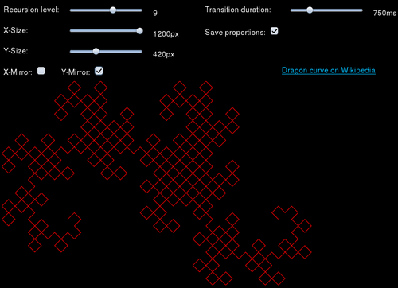

D3play
======

Nothing very useful here. Just playing with JavaScript and D3.

Hopefully there will be beautiful/funny results.

Have a look
-----------

### Dragon curve

A Dragon curve generated dynamically. [Go to page]()
